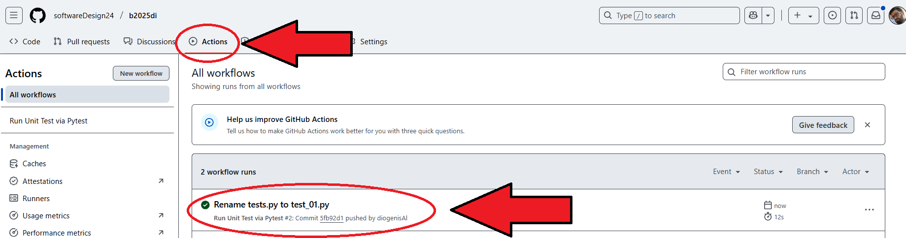

# micro-task 06
## 1. Introduction
* Based on the Class Diagram (see Sub02), choose one class and write its code. 
* Then create a simple unit testing file (with the programming language you chose) with at least two tests.

## 2. Goals
During this task, you have to build in the **Sub06** folder at least the following **2 files**:
- [ ] In the first file (e.g. [circulatory_system.py](circulatory_system.py)), code at least **1 class** that contains at least **1 attribute** and **1 method**.
- [ ] In the second file (e.g. [test_01.py](test_01.py)), code at least **2 unit testing functions**.

## 3. Guidelines
* You can choose any programming language you prefer. In this example, python 3.10 was implemented.
* Add the **requirements.txt** file in your repo (see the **[example](../requirements.txt)**). Provided that you selected python, that file should contain the unit testing library (pytest). If you choose a different language, you have to make the proper arrangements.
* Create **.github/workflows** folder and add the **python-unit_test.yml** file in it (see the **[example](../.github/workflows/python-unit_test.yml)**). Provided that you selected python, the file should contain the necessary key-value pairs. If you choose a different language, you have to make the proper arrangements.
* Add the aforementioned files (example: [circulatory_system.py](circulatory_system.py) and  [test_01.py](test_01.py) in the **Sub06** folder).
 

If unit testing succeeds (it takes a few seconds to run), the a screen similar to the following screenshot will appear in your Github Actions tab:

<kbd></kbd>

 

## 4. Assumptions
* Assumption01: ................
* Assumption02: ................
* ...

## 5. Deadline
**Upload until**: 20-05-2025
